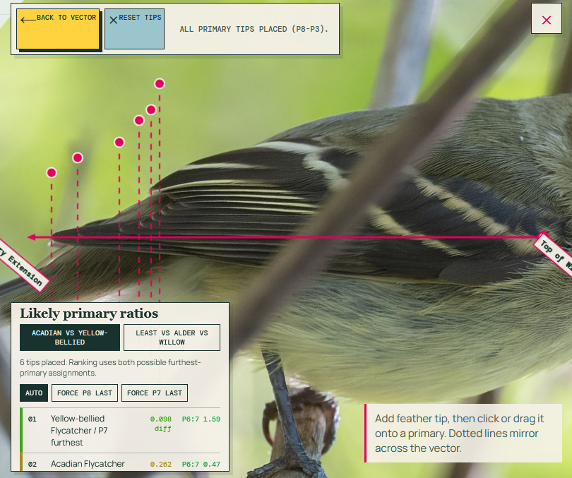

# empID

A small static web app for helping with Empidonax flycatcher identification.
 


## What it includes

- Reference and glossary browsing for Empidonax traits and species
- A questionnaire that narrows likely candidates by field marks
- A primary-tip tool for measuring feather spacing from a wing photo

## Current ptip scope

The primary-tip tool is currently tuned for just two comparisons:

- Acadian Flycatcher vs Yellow-bellied Flycatcher
- Least Flycatcher vs Alder Flycatcher vs Willow Flycatcher

It compares projected tip spacing along a user-drawn vector and highlights whether the measured P6:7 relationship matches the expected direction for the species under test.

## Open the app

The live app is available at https://exptofu.github.io/empID/

If you want to run it locally instead, open [index.html](index.html) directly in a browser, or serve the folder with a local static file server such as:

```bash
python -m http.server
```

Then visit http://localhost:8000/ in your browser.

## Files

- [index.html](index.html) — main app shell
- [js/index.js](js/index.js) — reference and questionnaire logic
- [js/ptip.js](js/ptip.js) — image-based primary-tip analysis
- [empid_traits.json](empid_traits.json) — species data
- [css/index.css](css/index.css) and [css/ptip.css](css/ptip.css) — styling

## Notes

- No backend or upload service is used.
- All analysis stays in-browser on the client side.
- The app is intentionally lightweight and framework-free.
