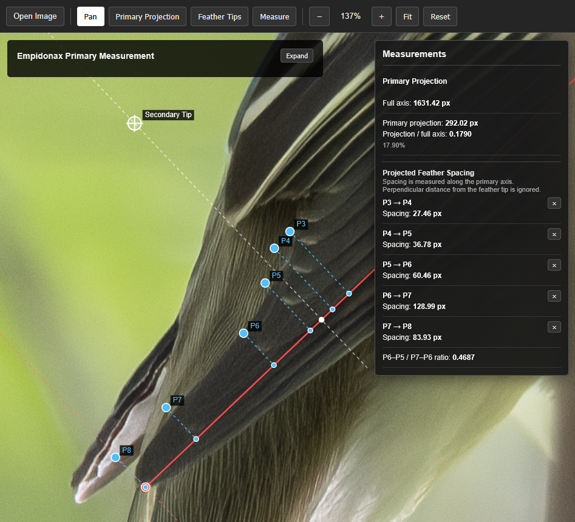

# Empidonax Primary Measurement Tool

This is a work-in-progress web app for people working with photos of Empidonax flycatchers (empids). It is an attempt to help identify which empid is in a photo by measuring primary feather tip spacing and other useful metrics.

The app lets you load an image, align a primary projection axis, mark the visible primary feather tips from P8 through P3, and calculate projected spacing and additional measurements in pixels. All image processing happens locally in the browser.

Try the live app: [exptofu.github.io/empID](https://exptofu.github.io/empID/)
